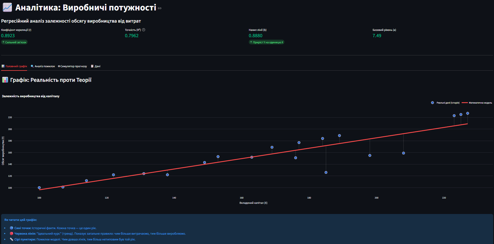
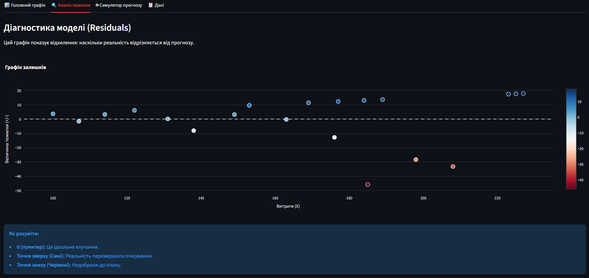
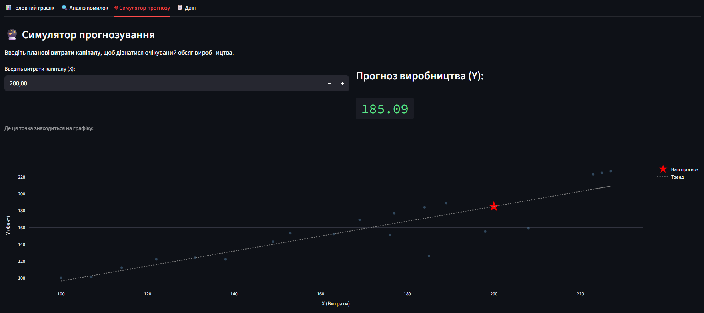
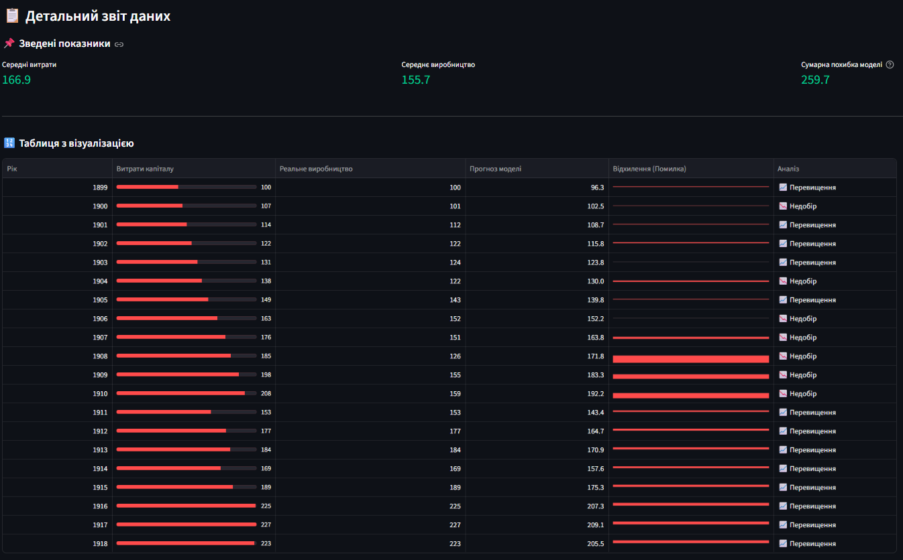

# 📈 Lab 6: Capital vs Production Analytics


Інтерактивний аналітичний дашборд для проведення **парного регресійного аналізу**. Розроблено в рамках Практичної роботи №6 з дисципліни "Математичне моделювання".

Проект аналізує історичні дані (1899–1918) для виявлення залежності між **витратами капіталу** та **обсягом виробництва**.

---

## 📸 Огляд функціоналу

### 1. Головний графік: Реальність проти Теорії
Візуалізація історичних даних (сині точки) та побудованої математичної моделі (червона лінія). Сірі пунктири демонструють відхилення (похибки) для кожного року.


### 2. Діагностика моделі (Residuals)
Аналіз залишків для перевірки якості моделі. Графік показує, в які роки модель переоцінила або недооцінила виробництво.


### 3. Симулятор прогнозування
Інтерактивний інструмент, що дозволяє ввести планові витрати капіталу та отримати миттєвий прогноз обсягу виробництва на основі розрахованих коефіцієнтів.


### 4. Детальний звіт
Таблиця з вбудованою візуалізацією (Heatmap & Progress Bars), що дозволяє швидко оцінити масштаб витрат та статус виконання плану (Недобір/Перевищення).


---

## 🧠 Математичне підґрунтя

В основі проекту лежить метод найменших квадратів (МНК). 
Програма автоматично розраховує параметри лінійної регресії:

$$Y = a + bX$$

Де:
* **X** — Витрати капіталу (незалежна змінна)
* **Y** — Обсяг виробництва (залежна змінна)
* **$R^2$** — Коефіцієнт детермінації (точність моделі)

---

## 🚀 Як запустити проект

Для запуску вам знадобиться встановлений Python.

1. **Клонуйте репозиторій:**
   ```bash
   git clone https://github.com/Lutvunenko-Dmutro/Lab6-Linear-Regression.git
   cd Lab6-Linear-Regression
2.  **Встановіть залежності:**

    ```bash
    pip install -r requirements.txt
    ```

3.  **Запустіть дашборд:**

    ```bash
    python -m streamlit run dashboard.py
    ```

-----

## 🛠 Технологічний стек

  * **Python** — Мова програмування
  * **Streamlit** — Веб-інтерфейс та інтерактивність
  * **Pandas** — Обробка табличних даних
  * **Scikit-Learn** — Розрахунок лінійної регресії
  * **Plotly** — Побудова інтерактивних графіків

-----

### 👨‍💻 Автор

**Литвиненко Дмитро** Студент групи I-23

